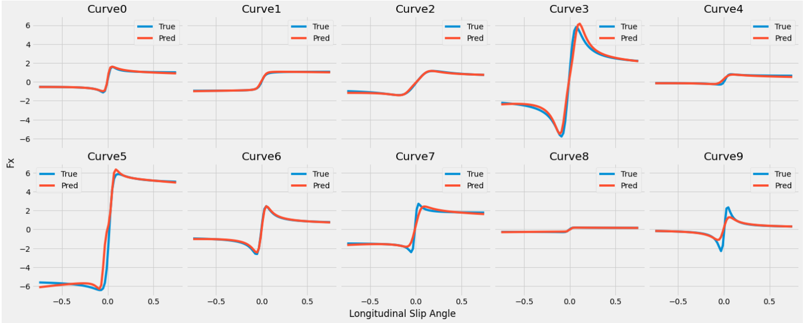

# Implementation of "An Alternative Method to Determine the Magic Tyre Model Parameters Using Genetic Algorithms" in Python
This repository contains a Python implementation of the paper titled "An Alternative Method to Determine the Magic Tyre Model Parameters Using Genetic Algorithms". The purpose of this implementation is to showcase how the proposed method can be applied to determine the parameters of the Magic Tyre Model using genetic algorithms. Additionally, it includes a notebook to generate graphs to visualize the results.

## Paper Information
* Title: An Alternative Method to Determine the Magic Tyre Model Parameters Using Genetic Algorithms
* Authors: J.A. CABRERA1,2, A. ORTIZ1, E. CARABIAS1 AND A. SIMON
* DOI: <https://www.tandfonline.com/doi/abs/10.1076/vesd.41.2.109.26496>

For more information click [here](https://www.researchgate.net/publication/232924414_An_Alternative_Method_to_Determine_the_Magic_Tyre_Model_Parameters_Using_Genetic_Algorithms)

## Introduction
The Magic Tyre Model, also known as the Pajecka tire model, is a widely used tire model in vehicle dynamics simulations. It provides an accurate representation of tire forces and moments under different operating conditions.
The problem addressed in this implementation is the determination of the Magic Tyre Model parameters in both longitudinal and lateral slip conditions knowing only vertical force on the tire and an array of measured forces in either longitudinal or lateral direction with respect to different slip values.

## Requirements
* Numpy
* matplotlib

## File structure
* geneticAlg.py: The main script that implements the genetic algorithm and determines the Magic Tyre Model parameters.
* algorithmEvaluation.ipynb: A notebook to generate graphs based on the results obtained.
* test_data/dataGeneration.py: A python script to generate Longitudinal forces values w.r.t different slip angles with pre-known tyre model parameters.
* results/: Directory to store the final generated parameters

## Results
The used error metric was different from the paper as we used Mean 
Absolute Percentage Error (MAPE). This error metric returns the error as a percentage which means that it will be easy to choose a value for minimum acceptable error that is not affected by the value of the Vertical force.

The resulted predicted curves was very much like the real curves in both pure longitudinal and lateral force.

